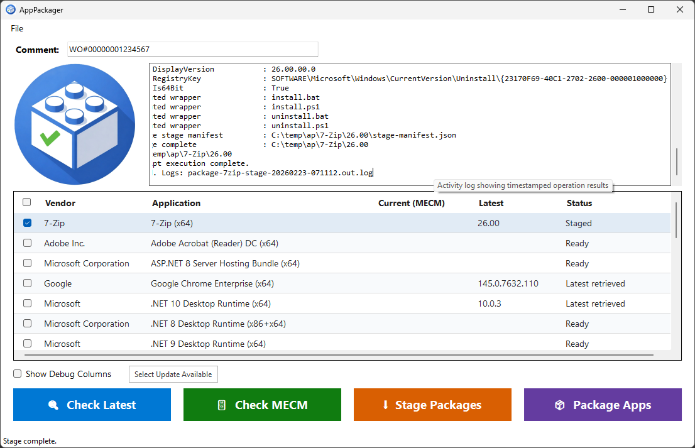

# AppPackager

PowerShell scripts and a WinForms GUI that automatically package the latest version of common enterprise applications into Microsoft Endpoint Configuration Manager (MECM) applications.

## What It Does

Each packager script operates in two phases:

**Stage** — Downloads the latest installer from the vendor's official source, extracts metadata (version, publisher, detection info), generates install/uninstall wrapper scripts, and writes a `stage-manifest.json`. Everything is built locally under a configurable download root. No network share or MECM required.

**Package** — Reads the stage manifest, copies the content folder to a versioned UNC network share, and creates an MECM Application with the appropriate deployment type and detection method.

The GUI (`start-apppackager.ps1`) provides a visual front-end that discovers packager scripts automatically, lets you check latest versions, query MECM for current versions, and stage or package selected applications.



## Prerequisites

| Requirement | Details |
|---|---|
| **OS** | Windows 10/11 or Windows Server 2016+ |
| **PowerShell** | 5.1 (ships with Windows) |
| **.NET Framework** | 4.8.2 (required by WinForms GUI) |
| **ConfigMgr Console** | Installed locally — provides `ConfigurationManager.psd1` (Package phase only) |
| **MECM Permissions** | RBAC rights to create Applications and Deployment Types (Package phase only) |
| **Local Admin** | Required for packager script execution |
| **Network Share** | Write access to the SCCM content share, e.g., `\\fileserver\sccm$` (Package phase only) |

## Setup

1. Clone the repository:
   ```
   git clone https://github.com/anon061035/application-packager.git
   ```

2. Open PowerShell **as Administrator**.

3. Navigate to the project directory:
   ```powershell
   cd application-packager\0.0.9
   ```

4. For the Package phase, ensure the ConfigMgr PSDrive is available in your session:
   ```powershell
   Import-Module (Join-Path $env:SMS_ADMIN_UI_PATH "..\ConfigurationManager.psd1")
   ```

## Usage

### GUI

Launch the WinForms front-end:

```powershell
.\start-apppackager.ps1
```

Or with custom parameters:

```powershell
.\start-apppackager.ps1 -SiteCode "MCM" -PackagersRoot "D:\CM\Packagers"
```

**No network or MECM actions occur on launch.** The GUI loads packager scripts locally and waits for you to act:

- **Check Latest** — queries vendor sources for the latest version of selected applications
- **Check MECM** — queries your ConfigMgr site for the currently deployed version
- **Stage Packages** — downloads installers, extracts metadata, generates wrappers and manifests locally
- **Package Apps** — reads manifests, copies content to network share, creates MECM applications

Settings that rarely change (Site Code, File Share Root, Download Root, Est/Max Runtime, Company Name) are managed via **File > Preferences** and persisted to `AppPackager.preferences.json`. Company Name is also synced to `packager-preferences.json` for use by ODT-based packagers. The Comment field remains on the main form for per-run entry. Window size and position are persisted automatically across sessions.

Additional grid features:
- **Right-click context menu** on any row — Open Log Folder, Open Staged Folder, Open Network Share, Copy Latest Version
- **Select Update Available** button — auto-checks only rows with "Update available" status after a version check
- **Real-time log streaming** — Stage and Package operations stream packager output line-by-line into the log pane as it runs
- **Tooltips** on all interactive controls — hover over any field or button for a description of its purpose

### Command Line

Run a packager script directly:

```powershell
# Stage only — download, extract metadata, generate wrappers + manifest
.\Packagers\package-chrome.ps1 -StageOnly

# Package only — read manifest, copy to network, create MECM app
.\Packagers\package-chrome.ps1 -PackageOnly -SiteCode "MCM" -Comment "WO#12345" -FileServerPath "\\fileserver\sccm$"

# Both phases in sequence (original behavior)
.\Packagers\package-chrome.ps1 -SiteCode "MCM" -Comment "WO#12345" -FileServerPath "\\fileserver\sccm$"

# Check the latest available version without downloading or creating an MECM application
.\Packagers\package-chrome.ps1 -GetLatestVersionOnly
```

All packager scripts accept the same core parameters:

| Parameter | Description |
|---|---|
| `-SiteCode` | ConfigMgr site code PSDrive name (default: `MCM`) |
| `-Comment` | Free-form change/WO text stored on the CM Application Description |
| `-FileServerPath` | UNC root containing the `Applications` folder (default: `\\fileserver\sccm$`) |
| `-DownloadRoot` | Local root folder for staging (default: `C:\temp\ap`) |
| `-EstimatedRuntimeMins` | MECM deployment type estimated runtime (default: `15`) |
| `-MaximumRuntimeMins` | MECM deployment type maximum runtime (default: `30`) |
| `-StageOnly` | Run only the Stage phase |
| `-PackageOnly` | Run only the Package phase |
| `-GetLatestVersionOnly` | Output the latest version string and exit |
| `-LogPath` | Path to a structured log file (timestamps + severity levels) |

## Supported Applications (36)

| Script | Vendor | Application | Detection Type |
|---|---|---|---|
| package-7zip.ps1 | Igor Pavlov | 7-Zip (x64) | RegistryKeyValue |
| package-adobereader.ps1 | Adobe Inc. | Adobe Acrobat Reader DC (x64) | File version |
| package-aspnethostingbundle8.ps1 | Microsoft | ASP.NET Core Hosting Bundle 8 | RegistryKey existence |
| package-chrome.ps1 | Google | Google Chrome Enterprise (x64) | RegistryKeyValue |
| package-dotnet8.ps1 | Microsoft | .NET Desktop Runtime 8 (x64) | Compound (AND, 2x File existence) |
| package-Dotnet9x64.ps1 | Microsoft | .NET Desktop Runtime 9 (x64) | File existence |
| package-Dotnet10x64.ps1 | Microsoft | .NET Desktop Runtime 10 (x64) | File existence |
| package-edge.ps1 | Microsoft | Microsoft Edge (x64) | Compound (OR, 2x File version) |
| package-filezilla.ps1 | FileZilla Project | FileZilla Client (x64) | RegistryKeyValue |
| package-firefox.ps1 | Mozilla | Mozilla Firefox (x64) | File version |
| package-git.ps1 | Git | Git for Windows (x64) | Script (git.exe --version) |
| package-greenshot.ps1 | Greenshot | Greenshot | File existence |
| package-keepass.ps1 | Dominik Reichl | KeePass | RegistryKeyValue |
| package-m365apps-x64.ps1 | Microsoft | M365 Apps for Enterprise (x64) | File version (WINWORD.EXE) |
| package-m365apps-x86.ps1 | Microsoft | M365 Apps for Enterprise (x86) | File version (WINWORD.EXE) |
| package-m365visio-x64.ps1 | Microsoft | M365 Visio (x64) | File version (VISIO.EXE) |
| package-m365visio-x86.ps1 | Microsoft | M365 Visio (x86) | File version (VISIO.EXE) |
| package-m365project-x64.ps1 | Microsoft | M365 Project (x64) | File version (WINPROJ.EXE) |
| package-m365project-x86.ps1 | Microsoft | M365 Project (x86) | File version (WINPROJ.EXE) |
| package-msodbcsql18.ps1 | Microsoft | ODBC Driver 18 for SQL Server | RegistryKeyValue |
| package-msoledb.ps1 | Microsoft | OLE DB Driver for SQL Server | RegistryKeyValue |
| package-msvcruntimes.ps1 | Microsoft | VC++ 2015-2022 Redistributable (x86+x64) | Compound (AND, 2x RegistryKeyValue) |
| package-notepadplusplus.ps1 | Notepad++ | Notepad++ (x64) | File version |
| package-powerbidesktop.ps1 | Microsoft | Power BI Desktop (x64) | File version |
| package-putty.ps1 | Simon Tatham | PuTTY (x64) | RegistryKeyValue |
| package-ssms.ps1 | Microsoft | SQL Server Management Studio | File version (Ssms.exe) |
| package-teams.ps1 | Microsoft | Microsoft Teams Enterprise (x64) | Script (Get-AppxPackage) |
| package-vmwaretools.ps1 | Broadcom | VMware Tools (x64) | File version |
| package-vs2026.ps1 | Microsoft | Visual Studio 2026 Enterprise | File version (devenv.exe) |
| package-vlc.ps1 | VideoLAN | VLC Media Player (x64) | RegistryKeyValue |
| package-vscode.ps1 | Microsoft | Visual Studio Code (x64) | File version |
| package-webex.ps1 | Cisco | Webex (x64) | RegistryKeyValue |
| package-webview2.ps1 | Microsoft | WebView2 Evergreen Runtime | File version |
| package-winscp.ps1 | WinSCP | WinSCP | RegistryKeyValue |
| package-wireshark.ps1 | Wireshark Foundation | Wireshark (x64) | RegistryKeyValue |
| package-zoom.ps1 | Zoom Video Communications | Zoom Workplace (x64) | File existence (per-user) |

## Content Staging Layout

### Local staging (Stage phase)

```
C:\temp\ap\
  <App>\
    staged-version.txt              # Version marker for Package phase
    <Version>\
      installer.msi (or .exe)
      install.bat
      install.ps1
      uninstall.bat
      uninstall.ps1
      stage-manifest.json           # Metadata for Package phase
```

### Network share (Package phase)

```
\\fileserver\sccm$\
  Applications\
    <Vendor>\
      <Application>\
        <Version>\
          installer.msi (or .exe)
          install.bat
          install.ps1
          uninstall.bat
          uninstall.ps1
```

Every content folder contains **four wrapper files** alongside the installer. The `.bat` files are thin wrappers that call the corresponding `.ps1`:

```batch
@echo off
PowerShell.exe -NonInteractive -ExecutionPolicy Bypass -File "%~dp0install.ps1"
exit /b %ERRORLEVEL%
```

The `.ps1` files contain the actual install/uninstall logic using `Start-Process -Wait -PassThru -NoNewWindow` and `exit $proc.ExitCode` to propagate native installer return codes (0, 1603, 3010, etc.) through to MECM.

**Why `.bat` wrappers?** MECM's Deployment Type "Hidden" visibility dropdown appends `/q` to install parameters. This conflicts with installers that already specify `/qn` or `/qb`. The `.bat` wrapper with `@echo off` prevents this by hiding the command window without injecting silent flags.

### Stage manifest (`stage-manifest.json`)

Written by the Stage phase, read by the Package phase. Contains all metadata needed to create the MECM application without re-downloading or re-parsing the installer:

```json
{
  "SchemaVersion": 1,
  "StagedAt": "2026-02-23T04:00:00Z",
  "AppName": "7-Zip - 25.01 (x64)",
  "Publisher": "Igor Pavlov",
  "SoftwareVersion": "25.01",
  "InstallerFile": "7zip-x64.msi",
  "Detection": {
    "Type": "RegistryKeyValue",
    "RegistryKeyRelative": "SOFTWARE\\Microsoft\\Windows\\CurrentVersion\\Uninstall\\{23170F69-...}",
    "ValueName": "DisplayVersion",
    "ExpectedValue": "25.01.00.0",
    "Operator": "IsEquals",
    "Is64Bit": true
  }
}
```

Five detection types are supported: `RegistryKeyValue`, `RegistryKey`, `File`, `Script`, and `Compound` (multiple clauses with AND/OR connectors).

## Project Structure

```
application-packager/
  0.0.9/
    start-apppackager.ps1              # WinForms GUI
    apppackager-logo.jpg               # GUI window icon / logo
    apppackager.ico                    # Application icon
    Packagers/
      AppPackagerCommon.psm1           # Shared module (logging, wrappers, MECM helpers)
      AppPackagerCommon.psd1           # Module manifest
      packager-preferences.json        # Universal packager settings (CompanyName, etc.)
      package-7zip.ps1                 # One script per application
      package-chrome.ps1
      ...
  CHANGELOG.md
  README.md
```

## Adding a New Packager

1. Create a new file in `0.0.9/Packagers/` named `package-<appname>.ps1`

2. Add metadata tags in the script header (parsed by the GUI):
   ```powershell
   <#
   Vendor: Acme Corp
   App: Acme Widget (x64)
   CMName: Acme Widget
   #>
   ```

3. Implement the standard parameter block:
   ```powershell
   param(
       [string]$SiteCode = "MCM",
       [string]$Comment = "WO#00000001234567",
       [string]$FileServerPath = "\\fileserver\sccm$",
       [string]$DownloadRoot = "C:\temp\ap",
       [int]$EstimatedRuntimeMins = 15,
       [int]$MaximumRuntimeMins = 30,
       [string]$LogPath,
       [switch]$GetLatestVersionOnly,
       [switch]$StageOnly,
       [switch]$PackageOnly
   )
   ```

4. Import the shared module:
   ```powershell
   Import-Module "$PSScriptRoot\AppPackagerCommon.psd1" -Force
   Initialize-Logging -LogPath $LogPath
   ```

5. Implement `Invoke-Stage<App>`:
   - Download the installer
   - Extract metadata (version, publisher, detection info)
   - Generate wrapper content and call `Write-ContentWrappers`
   - Call `Write-StageManifest` with detection block
   - Write `staged-version.txt`

6. Implement `Invoke-Package<App>`:
   - Read `staged-version.txt` and `stage-manifest.json` via `Read-StageManifest`
   - Copy content to network share via `Get-NetworkAppRoot`
   - Call `New-MECMApplicationFromManifest`

7. Wire up the main block:
   ```powershell
   if ($StageOnly) { Invoke-StageAcmeWidget }
   elseif ($PackageOnly) { Invoke-PackageAcmeWidget }
   else { Invoke-StageAcmeWidget; Invoke-PackageAcmeWidget }
   ```

8. The `-GetLatestVersionOnly` switch must output **only** the version string to stdout and exit.

The GUI will automatically discover and display the new script on next launch.

## Shared Module (`AppPackagerCommon.psm1`)

All packager scripts import the shared module which provides:

| Function | Purpose |
|---|---|
| `Write-Log` | Timestamped, severity-tagged logging to console and optional file |
| `Initialize-Logging` | Sets up log file output |
| `Invoke-DownloadWithRetry` | curl.exe download wrapper with 1 retry and 5s delay |
| `Test-IsAdmin` | Checks for administrator elevation |
| `Connect-CMSite` | Imports ConfigMgr module and sets PSDrive location |
| `Initialize-Folder` | Creates directory if missing |
| `Test-NetworkShareAccess` | Verifies UNC path is writable |
| `Get-MsiPropertyMap` | Reads MSI properties (ProductName, ProductVersion, Manufacturer, ProductCode) |
| `Find-UninstallEntry` | Searches ARP registry keys by DisplayName pattern |
| `Write-ContentWrappers` | Generates install/uninstall .bat + .ps1 wrapper files |
| `New-MsiWrapperContent` | Returns MSI install/uninstall .ps1 content strings |
| `New-ExeWrapperContent` | Returns EXE install/uninstall .ps1 content strings |
| `Get-NetworkAppRoot` | Constructs and initializes the network share path |
| `Write-StageManifest` / `Read-StageManifest` | JSON manifest serialization |
| `New-MECMApplicationFromManifest` | Creates MECM Application + deployment type from manifest |
| `Remove-CMApplicationRevisionHistoryByCIId` | Trims old application revisions |
| `Get-PackagerPreferences` | Reads `packager-preferences.json` for universal settings (e.g., CompanyName) |
| `New-OdtConfigXml` | Generates full ODT configuration XML for M365 download/install phases |
