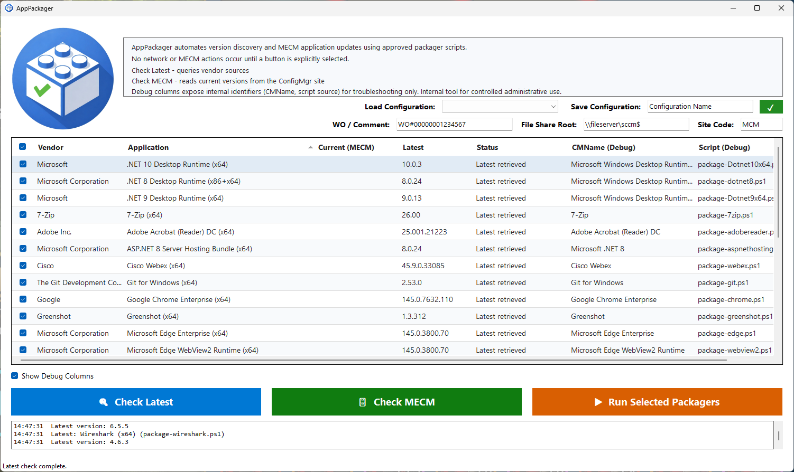

# AppPackager

PowerShell scripts and a WinForms GUI that automatically package the latest version of common enterprise applications into Microsoft Endpoint Configuration Manager (MECM) applications.

## What It Does

Each packager script:

1. Fetches the latest version from the vendor's official source (API, download page, or release feed)
2. Downloads the installer
3. Stages content to a versioned folder on a UNC network share
4. Creates an MECM Application with the appropriate deployment type and detection method

The GUI (`start-apppackager.ps1`) provides a visual front-end that discovers packager scripts automatically, lets you check latest versions, query MECM for current versions, and run selected packagers — all without touching the command line.



## Prerequisites

| Requirement | Details |
|---|---|
| **OS** | Windows 10/11 or Windows Server 2016+ |
| **PowerShell** | 5.1 (ships with Windows) |
| **.NET Framework** | 4.8.2 (required by WinForms GUI) |
| **ConfigMgr Console** | Installed locally — provides `ConfigurationManager.psd1` |
| **MECM Permissions** | RBAC rights to create Applications and Deployment Types |
| **Local Admin** | Required for packager script execution |
| **Network Share** | Write access to the SCCM content share (e.g., `\\fileserver\sccm$`) |

## Setup

1. Clone the repository:
   ```
   git clone https://github.com/anon061035/application-packager.git
   ```

2. Open PowerShell **as Administrator**.

3. Ensure the ConfigMgr PSDrive is available in your session. If not already connected:
   ```powershell
   Import-Module (Join-Path $env:SMS_ADMIN_UI_PATH "..\ConfigurationManager.psd1")
   ```

4. Navigate to the project directory:
   ```powershell
   cd application-packager\0.0.7
   ```

## Usage

### GUI

Launch the WinForms front-end:

```powershell
.\start-apppackager.ps1
```

Or with custom parameters:

```powershell
.\start-apppackager.ps1 -SiteCode "MCM" -PackagersRoot "D:\CM\Packagers"
```

**No network or MECM actions occur on launch.** The GUI loads packager scripts locally and waits for you to act:

- **Check Latest** — queries vendor sources for the latest version of selected applications
- **Check MECM** — queries your ConfigMgr site for the currently deployed version
- **Run Selected** — downloads, stages, and creates MECM applications for selected rows

The GUI supports saving and loading named configurations (site code, file share root, work order/comment) so you don't have to re-enter them each session.

### Command Line

Run a packager script directly:

```powershell
# Package the latest version of an application
.\Packagers\package-chrome.ps1 -SiteCode "MCM" -Comment "WO#12345" -FileServerPath "\\fileserver\sccm$"

# Check the latest available version without downloading or creating an MECM application
.\Packagers\package-chrome.ps1 -GetLatestVersionOnly
```

All packager scripts accept the same core parameters:

| Parameter | Description |
|---|---|
| `-SiteCode` | ConfigMgr site code PSDrive name (default: `MCM`) |
| `-Comment` | Free-form change/WO text stored on the CM Application Description |
| `-FileServerPath` | UNC root containing the `Applications` folder (default: `\\fileserver\sccm$`) |
| `-GetLatestVersionOnly` | Output the latest version string and exit — no download, no MECM changes |

## Supported Applications

| Script | Vendor | Application | Detection Method |
|---|---|---|---|
| package-7zip.ps1 | 7-Zip | 7-Zip (x64) | Windows Installer (MSI) |
| package-adobereader.ps1 | Adobe Inc. | Adobe Acrobat Reader DC (x64) | File version |
| package-aspnethostingbundle8.ps1 | Microsoft | ASP.NET Core Hosting Bundle 8 | Windows Installer (MSI) |
| package-chrome.ps1 | Google | Google Chrome Enterprise (x64) | Windows Installer (MSI) |
| package-dotnet8.ps1 | Microsoft | .NET Desktop Runtime 8 (x64) | Windows Installer (MSI) |
| package-Dotnet9x64.ps1 | Microsoft | .NET Desktop Runtime 9 (x64) | Windows Installer (MSI) |
| package-Dotnet10x64.ps1 | Microsoft | .NET Desktop Runtime 10 (x64) | Windows Installer (MSI) |
| package-edge.ps1 | Microsoft | Microsoft Edge (x64) | Windows Installer (MSI) |
| package-firefox.ps1 | Mozilla | Mozilla Firefox (x64) | File version |
| package-git.ps1 | Git | Git for Windows (x64) | PowerShell registry script |
| package-greenshot.ps1 | Greenshot | Greenshot | File version |
| package-msodbcsql18.ps1 | Microsoft | ODBC Driver 18 for SQL Server | Windows Installer (MSI) |
| package-msoledb.ps1 | Microsoft | OLE DB Driver for SQL Server | Windows Installer (MSI) |
| package-msvcruntimes.ps1 | Microsoft | VC++ 2015-2022 Redistributable (x86+x64) | Registry (dual-key AND) |
| package-notepadplusplus.ps1 | Notepad++ | Notepad++ (x64) | File version |
| package-powerbidesktop.ps1 | Microsoft | Power BI Desktop (x64) | File version |
| package-tableaudesktop.ps1 | Salesforce (Tableau) | Tableau Desktop (x64) | File version |
| package-tableauprep.ps1 | Salesforce (Tableau) | Tableau Prep Builder (x64) | File version |
| package-tableaureader.ps1 | Salesforce (Tableau) | Tableau Reader (x64) | File version |
| package-teams.ps1 | Microsoft | Microsoft Teams Enterprise (x64) | PowerShell script (AppxPackage) |
| package-vmwaretools.ps1 | Broadcom | VMware Tools (x64) | File version |
| package-vscode.ps1 | Microsoft | Visual Studio Code (x64) | File version |
| package-webex.ps1 | Cisco | Webex (x64) | File version |
| package-webview2.ps1 | Microsoft | WebView2 Evergreen Runtime | Windows Installer (MSI) |
| package-winscp.ps1 | WinSCP | WinSCP | File version |
| package-wireshark.ps1 | Wireshark Foundation | Wireshark (x64) | File version |

## Content Staging Layout

Packager scripts create a standardized folder structure on the network share:

```
\\fileserver\sccm$\
  Applications\
    <Vendor>\
      <Application>\
        <Version>\
          installer.msi (or .exe / .msix)
          install.bat
          install.ps1
          uninstall.bat
          uninstall.ps1
```

Every content folder contains **four wrapper files** alongside the installer. The `.bat` files are thin wrappers that call the corresponding `.ps1`:

```batch
@echo off
PowerShell.exe -NonInteractive -ExecutionPolicy Bypass -File "%~dp0install.ps1"
exit /b %ERRORLEVEL%
```

The `.ps1` files contain the actual install/uninstall logic using `Start-Process -Wait -PassThru -NoNewWindow` and `exit $proc.ExitCode` to propagate native installer return codes (0, 1603, 3010, etc.) through to MECM.

**Why `.bat` wrappers?** MECM's Deployment Type "Hidden" visibility dropdown appends `/q` to install parameters. This conflicts with installers that already specify `/qn` or `/qb`. The `.bat` wrapper with `@echo off` prevents this by hiding the command window without injecting silent flags.

## Project Structure

```
application-packager/
  0.0.7/
    start-apppackager.ps1          # WinForms GUI
    apppackager-logo.jpg           # GUI window icon / logo
    apppackager.ico                # Application icon
    Packagers/
      package-7zip.ps1             # One script per application
      package-chrome.ps1
      ...
```

## Adding a New Packager

1. Create a new file in `0.0.7/Packagers/` named `package-<appname>.ps1`

2. Add metadata tags in the script header (parsed by the GUI):
   ```powershell
   <#
   Vendor: Acme Corp
   App: Acme Widget (x64)
   CMName: Acme Widget
   #>
   ```

3. Implement the standard parameter block:
   ```powershell
   param(
       [string]$SiteCode = "MCM",
       [string]$Comment = "WO#00000001234567",
       [string]$FileServerPath = "\\fileserver\sccm$",
       [switch]$GetLatestVersionOnly
   )
   ```

4. The `-GetLatestVersionOnly` switch must output **only** the version string to stdout and exit.

5. The full run mode must download the installer, stage content, and call `New-CMApplication` + `Add-CMScriptDeploymentType` with `-AutoInstall $true`.

6. Generate all four content wrapper files (`install.bat`, `install.ps1`, `uninstall.bat`, `uninstall.ps1`):
   - `.bat` wrappers use the standard thin template (see Content Staging Layout above)
   - `.ps1` files use `Start-Process -Wait -PassThru -NoNewWindow` and `exit $proc.ExitCode`
   - Exception: VMware Tools `.bat` wrappers use `exit /b 3010` (hardcoded reboot) instead of `%ERRORLEVEL%`

The GUI will automatically discover and display the new script on next launch.
